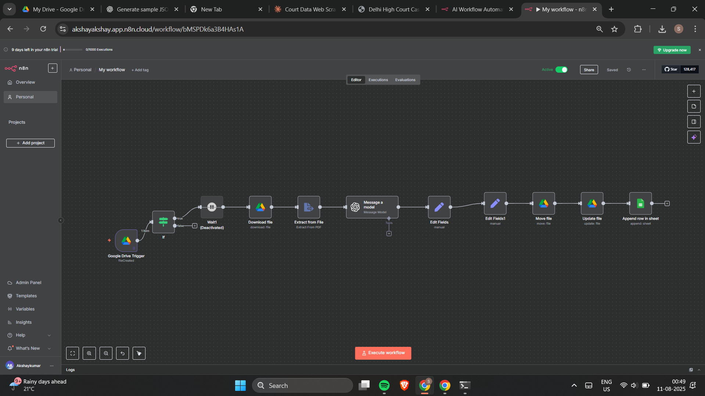

# AI-Powered Google Drive Automation (n8n Workflow)

This repository contains the **AI-Agent Smart Google Drive Assistant**, an automated file management system powered by **n8n**, **OpenAI**, and **Google Drive**. It intelligently classifies, renames, organizes, and logs files uploaded to Google Drive.

---

## 🧠 Overview

This workflow:

* Detects new uploads in Google Drive
* Extracts and analyzes file content
* Uses AI to classify files into business categories
* Renames files in a standard format
* Moves them into the correct folders
* Logs everything in Google Sheets for audit and tracking

This solves the problem of cluttered drives by turning them into organized, intelligent storage systems.

---

## 🖼️ Workflow Diagram

Below is the visual n8n workflow used in this automation:



---

## ✅ Completed Features

### **1. Google Drive File Trigger**

Automatically detects when a new file is uploaded.

### **2. File Download & Extraction**

Extracts text from PDF, Docs, Sheets, Slides.

### **3. AI-Based Classification**

Categorizes files into:

* Accounting
* Recruitment
* Sales
* Marketing
* Consulting
* Incorporation
* Personal
* Miscellaneous

### **4. File Organization**

* Renames file → `[Description] – [MM/DD/YYYY]`
* Moves to the correct folder
* Standardizes everything as PDF

### **5. Audit Logging**

Writes each file event to Google Sheets:

* File Name
* Category
* Timestamp
* File Type
* Destination Folder
* Approval Status
* File Links

---

## 🚧 In Progress

### **WhatsApp Command Interface**

A WhatsApp-based control system is being built. It will support:

```
LIST /Folder
DELETE /path/file.pdf
MOVE /source /dest
SUMMARY /Folder
HELP
```

---

## 🔧 Tech Stack

* **n8n** (workflow automation)
* **Google Drive API v3**
* **Google Sheets API**
* **OpenAI GPT-4.1-mini**
* **OAuth2** authentication

---

## 🏗️ Architecture Flow

1. File uploaded → Google Drive Trigger fires
2. n8n downloads and extracts content
3. AI analyses and classifies file
4. File renamed + moved to correct folder
5. Log entry added to Google Sheet

---

## 📦 Setup Instructions

### **1. Requirements**

* n8n instance (local, cloud, or Docker)
* Google Cloud project with Drive + Sheets API enabled
* OpenAI API Key

### **2. Environment Variables**

```
GOOGLE_CLIENT_ID=
GOOGLE_CLIENT_SECRET=
GOOGLE_REFRESH_TOKEN=
OPENAI_API_KEY=
AUDIT_SPREADSHEET_ID=
ACCOUNTING_FOLDER_ID=
RECRUITMENT_FOLDER_ID=
SALES_FOLDER_ID=
MARKETING_FOLDER_ID=
CONSULTING_FOLDER_ID=
INCORPORATION_FOLDER_ID=
PERSONAL_FOLDER_ID=
MISCELLANEOUS_FOLDER_ID=
```

### **3. Import Workflow into n8n**

* Go to **Workflows → Import**
* Select `My workflow.json`
* Configure credentials

---

## 🛡️ Security

* OAuth2 authentication
* Restricted folder access
* Logging & monitoring via Sheets
* Thorough error handling

---

## 🧭 Roadmap

* [x] Core automation
* [x] AI categorization
* [x] Audit logging
* [ ] WhatsApp command control
* [ ] Natural language query
* [ ] File search agent

---

If you'd like, I can also:

* Add a **folder structure section**
* Merge this README with your root project README
* Create a **professional GitHub description**
