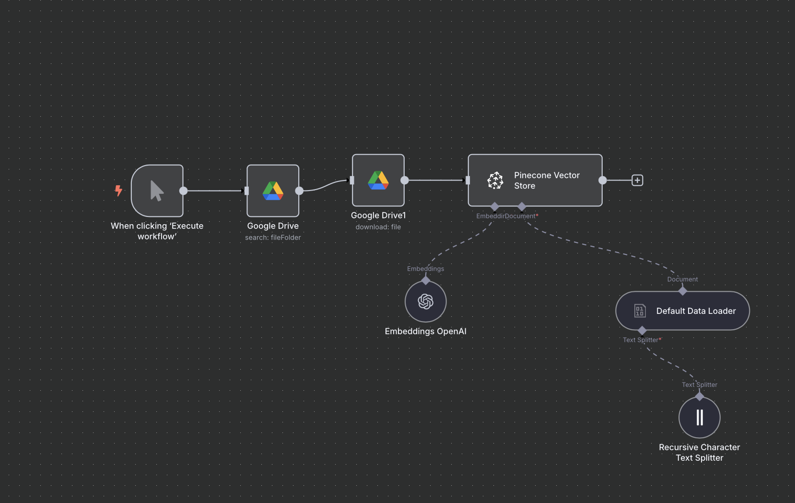
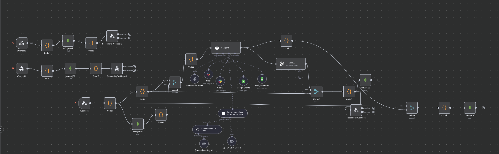
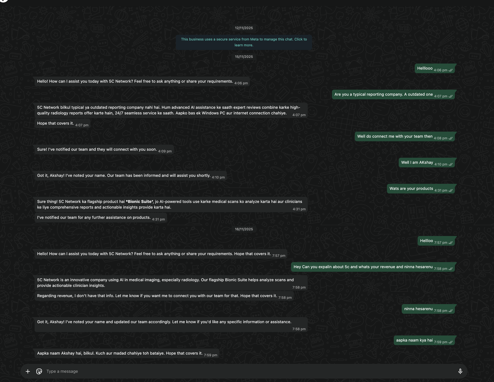

# WhatsApp Support Automation using Gupshup, n8n, Slack & Pinecone

This project implements an **automated customer support agent** built for WhatsApp using **Gupshup**, with workflow orchestration via **n8n**, **Slack-based human handoff**, and **Pinecone Vector Store** for AI‑powered contextual responses.

This solution was designed for internal use at **5C Network** to streamline customer interactions and improve response quality using AI.

---

## 🚀 Overview

The system automates WhatsApp chat handling end‑to‑end:

1. **Customer sends a message on WhatsApp** → Message reaches Gupshup.
2. **Gupshup webhook triggers n8n** → n8n workflow processes incoming messages.
3. **Conversation logic handled by AI** → Uses OpenAI + Pinecone for context & memory.
4. **If the message needs human intervention** → Slack alerts the support team.
5. **Team responds via Slack**, and n8n sends the message back to WhatsApp.

This ensures:

* Automated replies for general queries
* Human fallback for escalations
* Conversation logging in MongoDB
* Retrieval-Augmented Generation using company documents

---

## 🖼️ Architecture & Workflow

### **1️⃣ Vector Store + Document Ingestion**


*(`Screenshot 2025-12-10 at 12.33.28 AM.png`)*

This flow uploads documents from Google Drive, splits text, generates embeddings using OpenAI, and stores them in **Pinecone** for RAG‑based query responses.

---

### **2️⃣ Main n8n Workflow (AI Agent + Slack + WhatsApp)**


*(`554b50d7-d255-468d-aa15-9833972fa686.png`)*

The workflow handles:

* Incoming WhatsApp messages via Gupshup webhook
* MongoDB-based session storage
* Slack notifications for manual takeover
* AI-based responses using OpenAI
* Vector store lookups for contextual answers

---

### **3️⃣ WhatsApp Chat Example**


*(`5120e66b-83da-4805-9708-c51b87cb3017.png`)*

This is an example conversation showing how the bot:

* Responds instantly
* Provides meaningful explanations
* Escalates to the human team when needed

---

## 🧩 Components Used

### **1. Gupshup WhatsApp API**

* Receives incoming messages
* Sends automated or human-handled replies

### **2. n8n Workflows**

* Core logic engine
* Handles AI calls, Slack handoff, DB storage

### **3. Slack Integration**

* Notifies support team
* Allows agents to reply directly from Slack

### **4. Pinecone Vector DB**

* Stores embeddings of company documents
* Retrieves relevant context → improves AI response accuracy

### **5. MongoDB**

* Maintains conversation history
* Tracks user sessions

---

## 🔄 Message Flow Summary

1. **WhatsApp User → Gupshup**
2. **Gupshup → Webhook → n8n**
3. n8n:

   * Parses message
   * Retrieves past context (MongoDB)
   * Pulls relevant docs (Pinecone)
   * Generates AI reply (OpenAI)
   * Sends reply back through Gupshup
4. **If escalation needed → Slack alert**
5. Slack reply → back to WhatsApp via n8n

---

## 📦 Folder Structure Suggestion

```
project-root/
│ README.md
│
├── assets/
│   ├── Screenshot1.png
│   ├── Screenshot2.png
│   └── Screenshot3.png
│
├── workflows/
│   └── n8n-export.json
│
└── scripts/
    └── additional-utilities.md
```

---

## 📝 Notes

* Replace the image names in the `assets` folder with the actual filenames.
* Make sure the Gupshup webhook URL and Slack bot tokens are properly secured.
* Pinecone API key should be stored in environment variables.

---

## 📧 Contact

For further details or setup support, reach out to the project maintainer.

---

If you'd like, I can also generate:

* A **professional GitHub description**
* A **project banner**
* A **flow diagram** in Mermaid format
* A **deployment guide**
